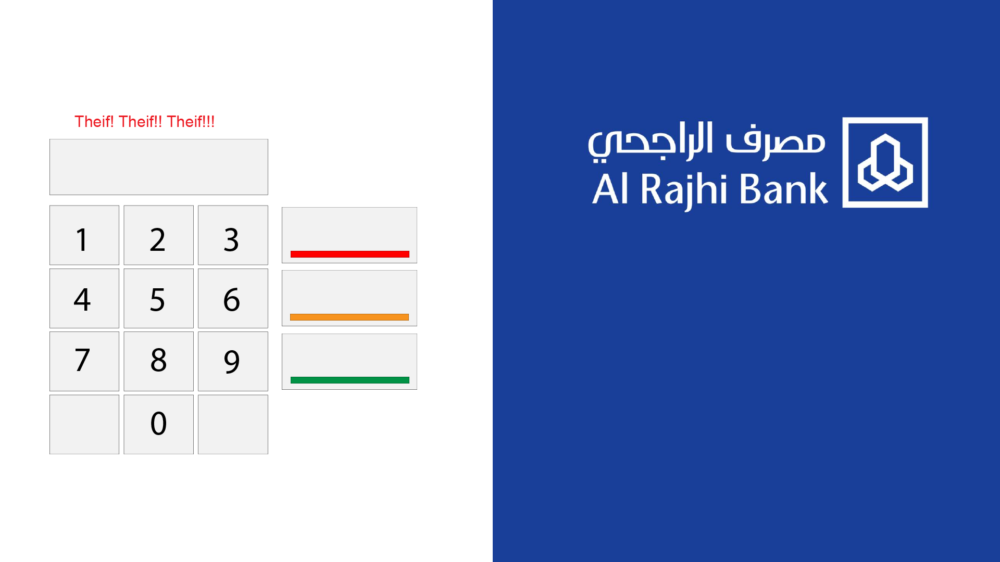
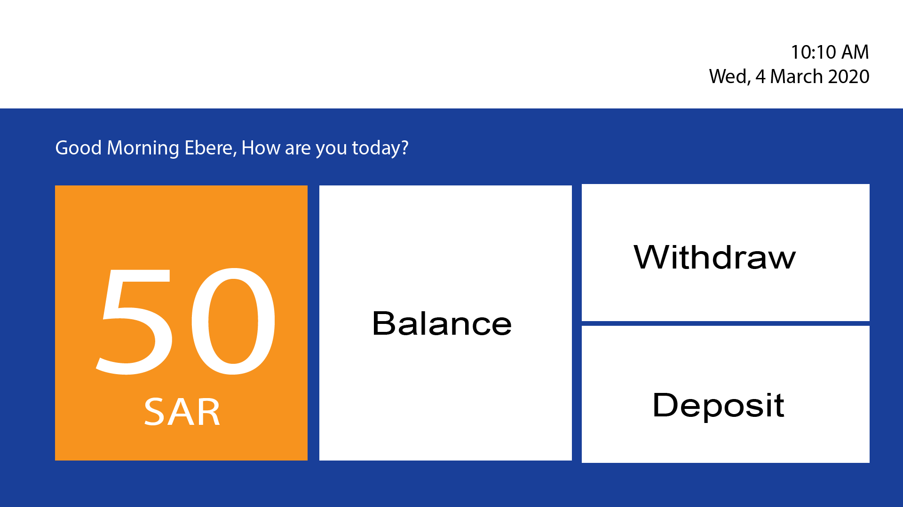
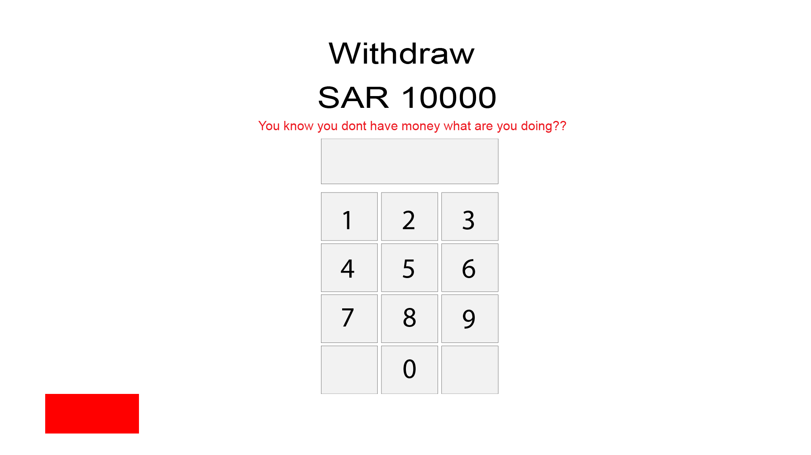
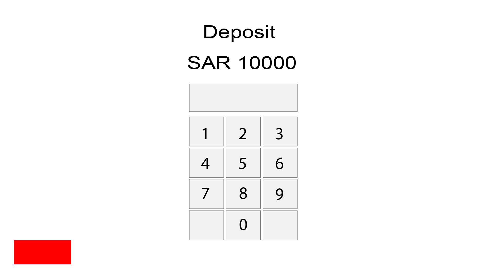
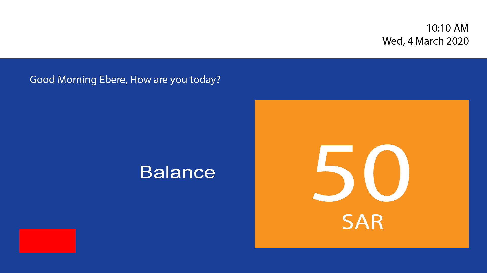

## ATM Task

In the last few days, we have studied DOM using Vanilla JavaScript and JQuery. We learnt selecting element on the HTML can be as simple as:

|JavaScript | JQuery |
|-----------|--------|
|`document.querySelector("selector")`| `$(selector)`|

### Task Description.

Mr. Ebere has decided to visit Al Rajhi Bank ATM to witdrawal some money. He should have SAR 10000 in his account but he would like to perform the following transactions:

1. Enter PIN and only pass it PIN is correct.
1. Check his balance.
1. If he has enough money, he would would like to witdraw SAR 9000 to buy a new iPhone.
1. Atheer asks him for 500 SAR so he tries to take out another 500 SAR
1. Yassir comes and asks for 400 SAR to go to corniche on Thursday to eat the most delicious pasta in the world. So Ebere should withdraw 400 SAR.
1. Saad comes and asks for 300 SAR but now Ebere should have 100 SAR left and the ATM should show `insufficient balance`

### Screenshots
Login Screen

Dashboard Screen

Withdrawal Screen

Deposit Screen

View Balance Screen

### Helpers
#### JQuery
1. `$("selector").hide()`
1. `$("selector").show()`

#### JavaScript
1. `document.querySelector("selector").style.display = "none" //hide`
1. `document.querySelector("selector").style.display = "block" //show`
